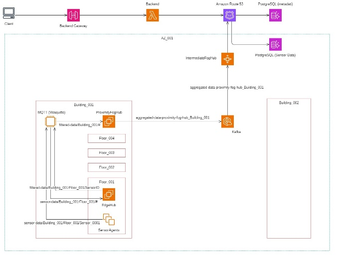
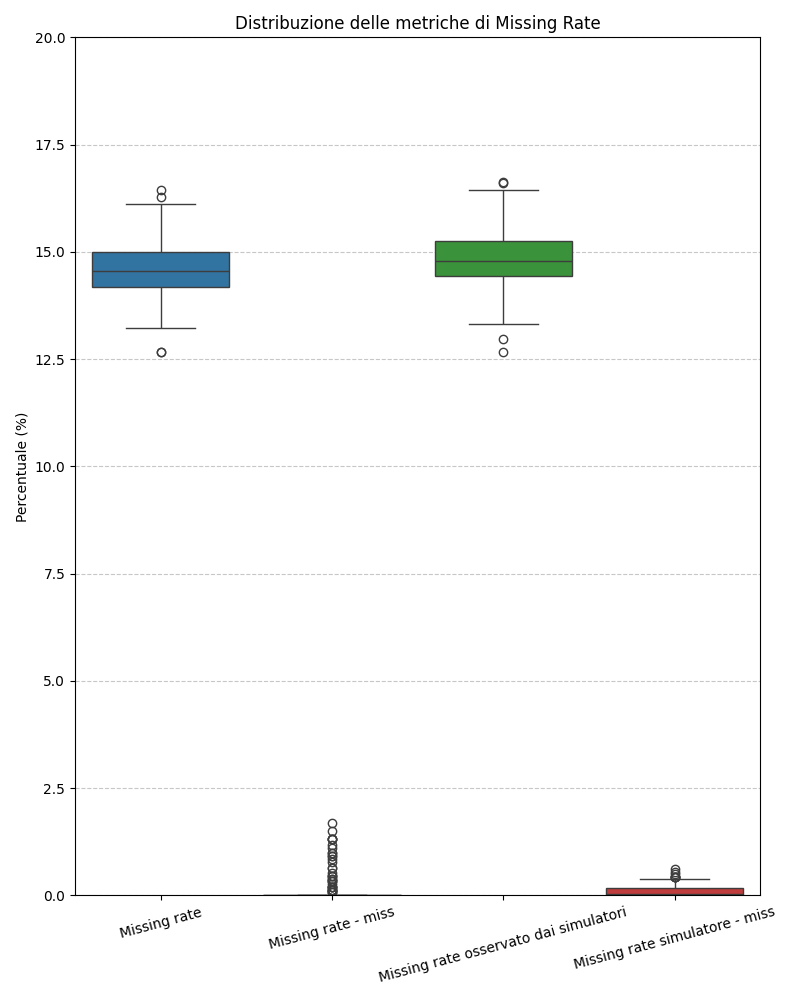
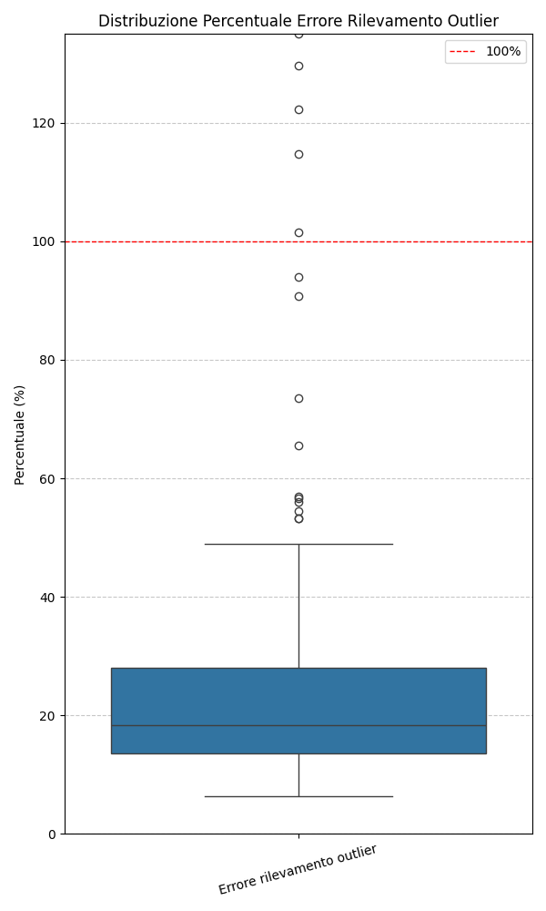
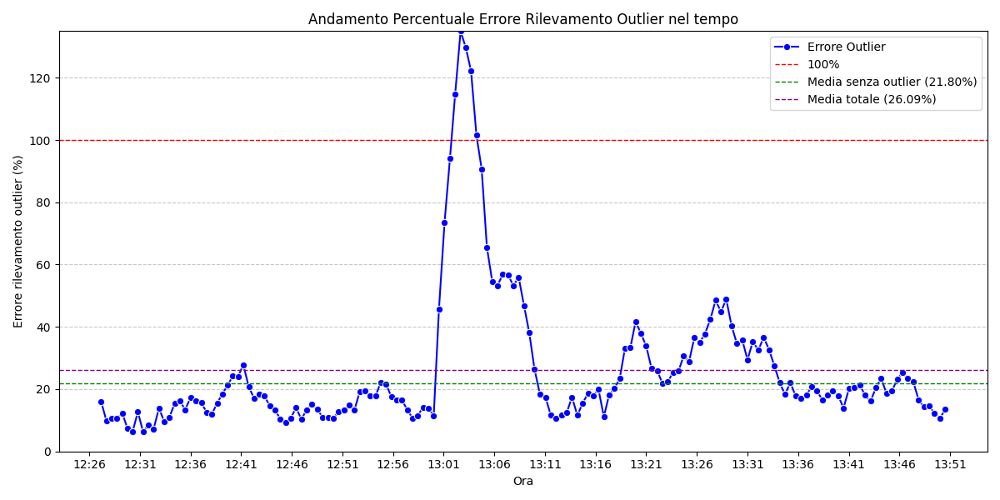
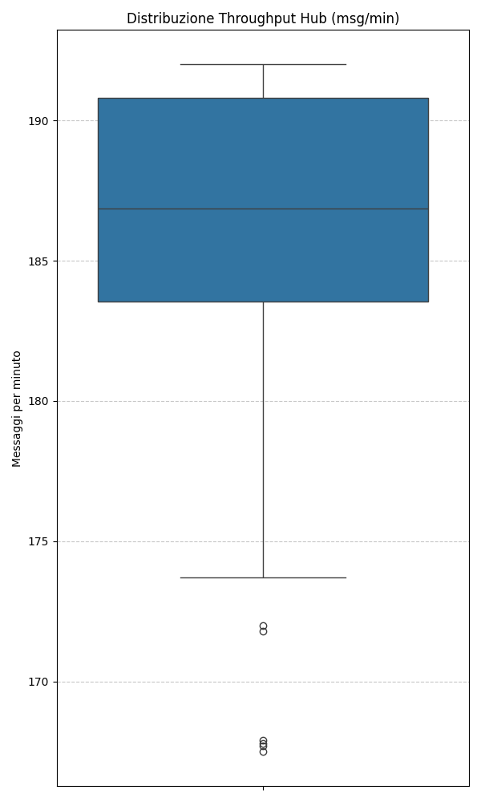
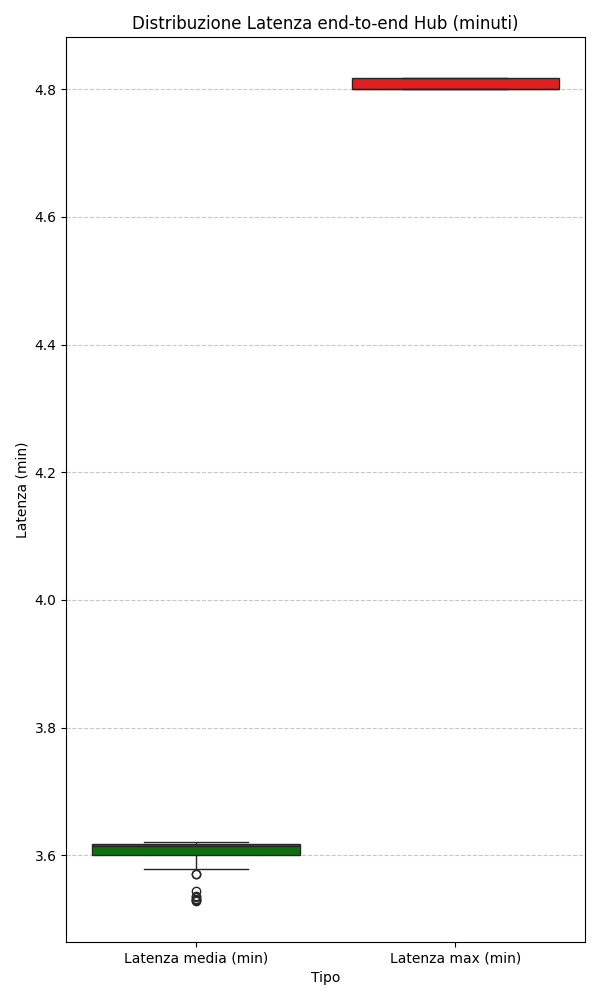

# Sensor Continuum: Applicazione Distribuita nel Compute Continuum

Il presente repository documenta la progettazione, l'implementazione e la valutazione di un **sistema di sensori distribuiti su larga scala** che adotta il paradigma del **Compute Continuum**. Tale architettura è concepita per estendere le capacità computazionali dal **Cloud** fino al "bordo" della rete, indirizzando le criticità di latenza, banda e scalabilità tipiche delle reti di sensori IoT.

Il sistema distribuisce le attività di elaborazione e comunicazione dei dati attraverso **cinque livelli gerarchici** distinti: sensori, nodi Edge, nodi Proximity, nodi Intermediate e servizi Cloud, ottimizzando l'allocazione delle risorse nel punto più opportuno del *continuum*.

---

## Documentazione e Istruzioni Operative

Si specifica che la **documentazione tecnica dettagliata** del progetto, inclusi i risultati sperimentali, l'analisi delle prestazioni e le scelte architetturali, è integralmente disponibile nella cartella **`docs`**.

Le istruzioni operative per il **deployment locale** tramite Docker Compose e per l'implementazione su **AWS** mediante script CloudFormation sono anch'esse contenute nella medesima cartella, garantendo la riproducibilità e la scalabilità dell'ambiente.

---

## Metodologie e Tecnologie Centrali

Il progetto è fondato sull'integrazione sinergica di paradigmi e tecnologie avanzate, come evidenziato dalle seguenti parole chiave:

| Concetto | Descrizione e Applicazione                                                                                                                                                  |
| :--- |:----------------------------------------------------------------------------------------------------------------------------------------------------------------------------|
| **Compute Continuum** | Paradigma architetturale a cinque livelli che integra calcolo dal Cloud al bordo della rete.                                                                                |
| **Architettura Distribuita** | Struttura a **microservizi** e **serverless** per assicurare scalabilità, resilienza e sviluppo indipendente dei componenti.                                                |
| **Comunicazione Ibrida** | Utilizzo di **MQTT** per il livello Edge a bassa latenza e risorse limitate, e **Apache Kafka** per lo *streaming* di dati robusto e distribuito verso i livelli superiori. |
| **Linguaggio Go** | Scelto per l'implementazione di tutti i servizi, data la sua efficienza e la gestione nativa della concorrenza tramite *Go routines* e canali.                              |
| **AWS & Cloud Services** | Utilizzo di servizi **Serverless (AWS Lambda)** e **API Gateway** per l'accesso globale ai dati e l'esecuzione di analisi complesse sul livello Cloud.                      |

---

## Architettura a Cinque Livelli (Compute Continuum)

L'architettura definisce una gerarchia di componenti con responsabilità chiaramente delineate:

1.  **Sensor Agent:** Simula sensori fisici, genera misurazioni periodiche e introduce intenzionalmente *outlier* e dati mancanti per il realismo della simulazione. Comunica con l'Edge Hub tramite **MQTT**.
2.  **Edge Hub (Hub di Zona):** Esegue elaborazione a bassa latenza, incluso il **filtraggio degli outlier** e il salvataggio dei dati validati in una **cache locale volatile (Redis)**. Aggrega periodicamente i dati e li inoltra al Proximity Hub.
3.  **Proximity Hub (Hub di Macrozona):** Agisce come punto di aggregazione intermedio, salvando i dati in una **cache persistente (PostgreSQL)** e utilizzando il *pattern* **Transactional Outbox** per l'inoltro a Kafka. Calcola statistiche aggregate a livello di zona e macrozona.
4.  **Intermediate Hub (Hub di Regione/Fog):** Responsabile della persistenza a lungo termine dei dati regionali. Riceve i dati da Kafka, li raccoglie in *batch* e li salva nel database in blocco (**PostgreSQL COPY FROM**), ottimizzando l'efficienza di scrittura.
5.  **Servizi Cloud:** Il livello superiore che espone l'accesso ai dati a lungo termine tramite **API Serverless**, consentendo l'esecuzione di analisi complesse (e.g., correlazioni e variazioni annuali).

### Rappresentazione Architetturale

L'immagine seguente illustra la disposizione gerarchica dei componenti e il flusso comunicativo attraverso i diversi livelli:

---

## Risultati Sperimentali e Prestazioni

Le simulazioni hanno convalidato l'affidabilità e la gestione del carico del sistema, anche in presenza di vincoli di co-locazione e simulazioni di guasto

  
  
   
  
   
  
  

| Metrica | Risultato Osservato | Implicazione |
| :--- | :--- | :--- |
| **Miss Rate** | **$\approx$ 15%** (in linea con la simulazione). Perdite non simulate $\approx$ **0%**. | L'affidabilità della consegna al primo livello è elevata. |
| **Rilevamento Outlier** | Sovrastima $\approx$ **20%**. | Il meccanismo è **adattivo** e privilegia la cautela, mostrando picchi in corrispondenza del cambio d'ora. |
| **Throughput** | Stabile tra **185 e 190 pacchetti/minuto**. | Il sistema gestisce efficacemente il carico atteso di 200 sensori. |
| **Latenza End-to-End** | Media $\approx$ **3.6 minuti**. | La latenza sistematica è intenzionale e necessaria per il *buffering* e la coerenza temporale dei dati aggregati. |

---

## Future Prospettive

Il lavoro futuro sarà orientato all'incremento dell'efficienza e della robustezza del sistema:

* **Intelligenza all'Edge:** Integrazione di algoritmi di **Machine Learning leggero** negli Edge Hub per affinare l'accuratezza nel rilevamento degli *outlier*.
* **Monitoraggio Proattivo:** Implementazione del meccanismo di notifica via *email* per i manutentori in caso di rilevamento di sensori *unhealthy*.
* **Ottimizzazione della Latenza:** Studio di una *data pipeline fast lane* per misurazioni critiche o di emergenza, bypassando gli *offset* temporali per garantire la minima latenza possibile.

***

## Autori

* **Maurizio Renzi** (Matricola 0369222)
* **Francesco Masci** (Matricola 0365258)

**Progetto del Corso di Laurea Magistrale in Ingegneria Informatica**
*Sistemi Distribuiti e Cloud Computing (A.A. 2024/2025)*
Università degli Studi di Roma "Tor Vergata"