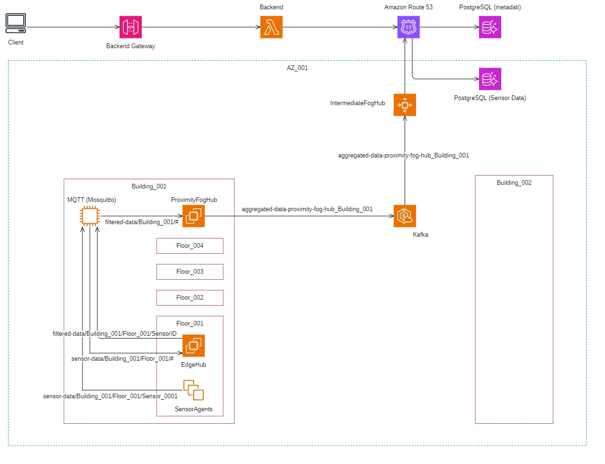

# Sensor Continuum: Applicazione Distribuita nel Compute Continuum

Il presente repository documenta la progettazione, l'implementazione e la valutazione di un sistema di sensori distribuiti su larga scala che adotta il paradigma del **Compute Continuum**. Tale architettura è concepita per estendere le capacità computazionali dal Cloud fino al "bordo" della rete, indirizzando le criticità di latenza, banda e scalabilità tipiche delle reti di sensori IoT.

Il sistema distribuisce le attività di elaborazione e comunicazione dei dati attraverso cinque livelli gerarchici distinti: sensori, nodi Edge, nodi Proximity, nodi Intermediate e servizi Cloud, ottimizzando l'allocazione delle risorse nel punto più opportuno del *continuum*.

---

## Documentazione e Istruzioni Operative

Si specifica che la documentazione tecnica dettagliata del progetto, inclusi i risultati sperimentali, l'analisi delle prestazioni e le scelte architetturali, è integralmente disponibile nella cartella [`docs`](./docs/).
All'interno di questa cartella è possibile trovare il [report](./docs/Sensor%20Continuum%20Report%20-%20Renzi%20Maurizio%200369222,%20Masci%20Francesco%200365258.pdf) tecnico dettagliato sul design e sull'implementazione del sistema.

Le istruzioni operative per il deployment locale tramite Docker Compose e per l'implementazione su AWS mediante script CloudFormation sono anch'esse contenute nella medesima cartella, dentro [`instructions`](./docs/instructions/), garantendo la riproducibilità e la scalabilità dell'ambiente.

---

## Metodologie e Tecnologie Centrali

Il progetto si basa sull'integrazione di metodologie e tecnologie avanzate, seguendo un approccio olistico che copre l'intero spettro del Compute Continuum. Questo paradigma architetturale si articola su cinque livelli distinti, dal Cloud fino al bordo della rete, garantendo una gestione del calcolo efficiente e distribuita.

L'Architettura Distribuita è un pilastro fondamentale, implementata attraverso un modello a microservizi e serverless. Questa scelta progettuale assicura elevata scalabilità, resilienza operativa e permette lo sviluppo e il deployment indipendente dei singoli componenti del sistema.

Per quanto riguarda la Comunicazione Ibrida, il progetto adotta soluzioni ottimali per ogni livello. Per l'Edge, dove la latenza e le risorse sono limitate, si utilizza MQTT. Man mano che i dati risalgono verso i livelli superiori, si impiega Apache Kafka per uno streaming robusto e distribuito, capace di gestire grandi volumi di dati.

Il Linguaggio Go è stato selezionato per l'implementazione di tutti i servizi. Questa scelta è motivata dalla sua notevole efficienza, dalle sue prestazioni elevate e dalla gestione nativa della concorrenza attraverso le Go routines e i canali, che facilitano lo sviluppo di sistemi altamente paralleli e reattivi.

Infine, l'infrastruttura si avvale ampiamente di AWS & Cloud Services. Vengono utilizzati servizi Serverless come AWS Lambda e API Gateway per garantire un accesso globale ai dati e per l'esecuzione di analisi complesse direttamente sul livello Cloud, massimizzando la flessibilità e l'efficienza.

## Architettura

L'architettura definisce una gerarchia di componenti con responsabilità chiaramente delineate:

1.  **Sensor Agent:** Simula sensori fisici, genera misurazioni periodiche e introduce intenzionalmente outlier e dati mancanti per il realismo della simulazione. Comunica con l'Edge Hub tramite MQTT.
2.  **Edge Hub (Hub di Zona):** Esegue elaborazione a bassa latenza, incluso il filtraggio degli outlier e il salvataggio dei dati validati in una cache locale volatile (Redis). Aggrega periodicamente i dati e li inoltra al Proximity Hub.
3.  **Proximity Hub (Hub di Macrozona):** Agisce come punto di aggregazione intermedio, salvando i dati in una cache persistente (PostgreSQL) e utilizzando il pattern Transactional Outbox per l'inoltro a Kafka. Calcola statistiche aggregate a livello di zona e macrozona.
4.  **Intermediate Hub (Hub di Regione):** Responsabile della persistenza a lungo termine dei dati regionali. Riceve i dati da Kafka, li raccoglie in batch e li salva nel database in blocco, ottimizzando l'efficienza di scrittura.
5.  **Servizi Cloud:** Il livello superiore che espone l'accesso ai dati a lungo termine tramite API Serverless, consentendo l'esecuzione di analisi complesse (e.g., correlazioni e variazioni annuali).

### Rappresentazione Architetturale

L'immagine seguente illustra la disposizione gerarchica dei componenti e il flusso comunicativo attraverso i diversi livelli:

---

## Risultati Sperimentali e Prestazioni

Le simulazioni hanno convalidato l'affidabilità e la gestione del carico del sistema, anche in presenza di vincoli di co-locazione e simulazioni di guasto

  
  
   
  
   
  
  

| Metrica                 | Risultato Osservato                                                                     | Implicazione                                                                                                      |
|:------------------------|:----------------------------------------------------------------------------------------|:------------------------------------------------------------------------------------------------------------------|
| **Miss Rate**           | **$\approx$ 15%** (in linea con la simulazione). Perdite non simulate $\approx$ **0%**. | L'affidabilità della consegna al primo livello è elevata.                                                         |
| **Rilevamento Outlier** | Sovrastima $\approx$ **20%**.                                                           | Il meccanismo è adattivo e privilegia la cautela, mostrando picchi in corrispondenza del cambio d'ora.            |
| **Throughput**          | Stabile tra **185 e 190 pacchetti/minuto**.                                             | Il sistema gestisce efficacemente il carico atteso di 200 sensori.                                                |
| **Latenza End-to-End**  | Media $\approx$ **3.6 minuti**.                                                         | La latenza sistematica è intenzionale e necessaria per il *buffering* e la coerenza temporale dei dati aggregati. |

---

## Future Prospettive

Il lavoro futuro sarà orientato all'incremento dell'efficienza e della robustezza del sistema:

* **Intelligenza all'Edge:** Integrazione di algoritmi di Machine Learning leggero negli Edge Hub per affinare l'accuratezza nel rilevamento degli outlier.
* **Monitoraggio Proattivo:** Implementazione del meccanismo di notifica via *email* per i manutentori in caso di rilevamento di sensori *unhealthy*.
* **Ottimizzazione della Latenza:** Studio di una *data pipeline fast lane* per misurazioni critiche o di emergenza, bypassando gli *offset* temporali per garantire la minima latenza possibile.

***

## Autori

* **Maurizio Renzi** (Matricola 0369222)
* **Francesco Masci** (Matricola 0365258)

**Progetto del Corso di Laurea Magistrale in Ingegneria Informatica**
*Sistemi Distribuiti e Cloud Computing (A.A. 2024/2025)*
Università degli Studi di Roma "Tor Vergata"